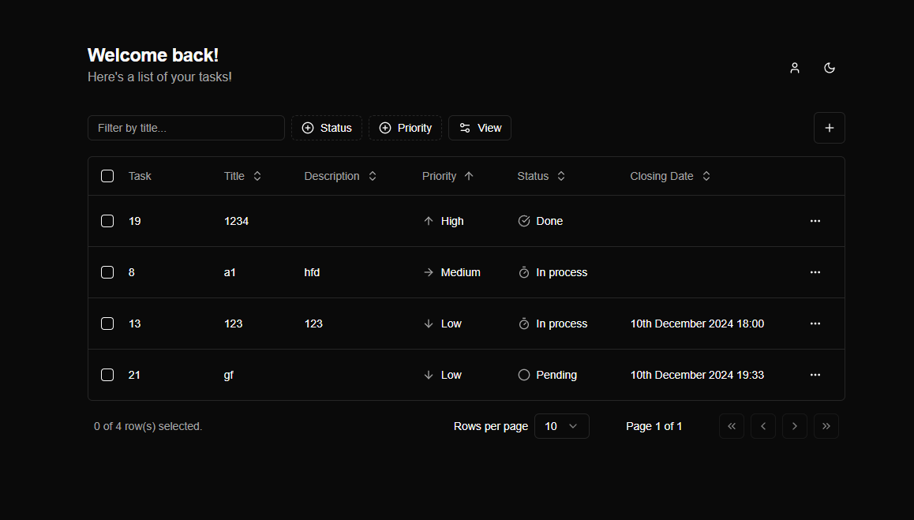
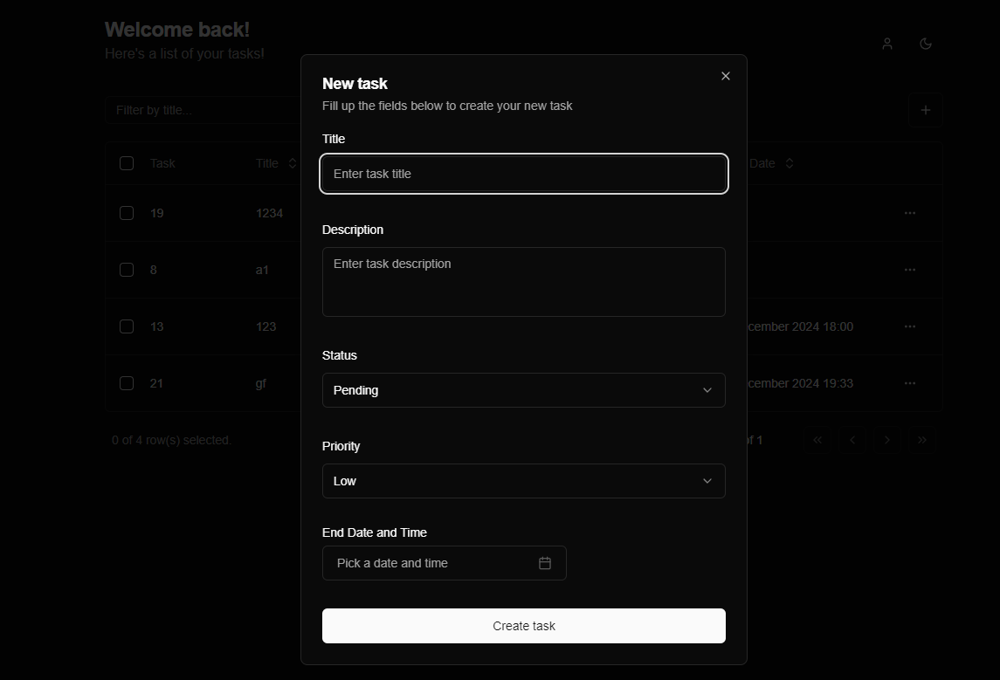
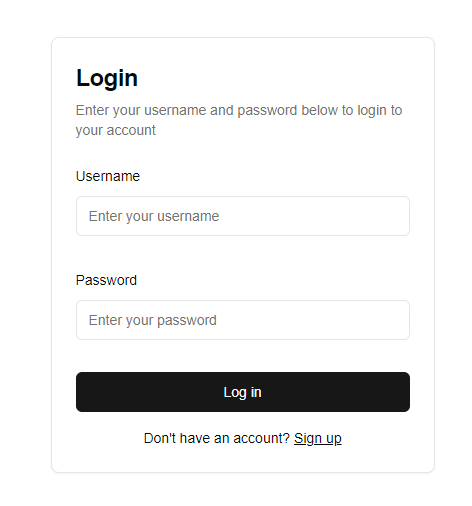

# Тестовое задание

Тестовое задание на позицию Fullstack-разработчик

## Built in

- Next.js
- TailwindCSS
- shadcn/ui

## Related

Backend part of project

[Task managment system](https://github.com/Persepha/task-managment-system-backend)

## Run Locally

Clone the project

```bash
  git clone https://github.com/Persepha/task-managment-system-frontend.git
```

Go to the project directory

```bash
  cd task-managment-system-frontend
```

Install dependencies

```bash
  npm install
```

Start the backend server (see backend part documentation)

Start the frontend server

```bash
  npm run dev
```

## Screenshots

Tasks



Create new task



Login


